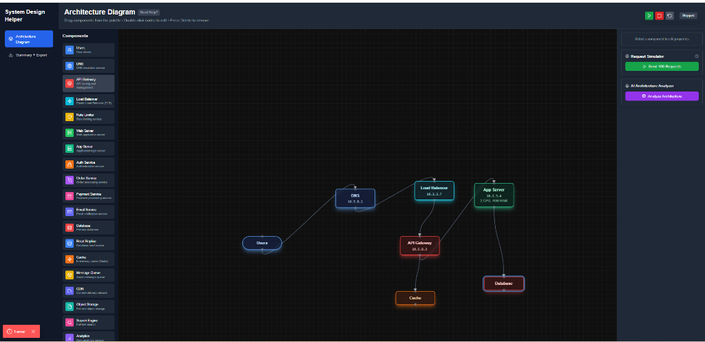

# System Design Helper



## Overview

System Design Helper is an interactive, visual tool for creating scalable system architecture diagrams. Built with Next.js and React Flow, it allows you to drag and drop components, simulate requests, and analyze your system's design.

## Features

- **Interactive Modeling**: Drag-and-drop interface with a comprehensive palette of system components (Load Balancers, Databases, Microservices, etc.).
- **Visual Simulation**: Visualize data flow and request processing to identify bottlenecks.
- **AI Analysis**: Get automated insights and suggestions for your architecture.
- **Request Simulator**: Test your system with customizable traffic loads.
- **Detailed Component Properties**: Configure RAM, CPU, and other specs for each node.

## Getting Started

### Prerequisites

- Node.js (v18 or higher)
- npm

### Installation

1. Clone the repository.
2. Install dependencies:
   ```bash
   npm install
   ```

### Running the Application

Start the development server:

```bash
npm run dev
```

Open [http://localhost:3000](http://localhost:3000) in your browser to start designing.

## Usage

1. **Add Components**: Drag components from the left palette onto the canvas.
2. **Connect Nodes**: Draw lines between components to define data flow.
3. **Configure**: Click a node to edit its properties (Label, Specs, etc.).
4. **Simulate**: Use the controls to visualize request traffic.
5. **Analyze**: Click "Analyze Architecture" to get AI-powered feedback.

## Tech Stack

- **Framework**: Next.js 14 (App Router)
- **Language**: TypeScript
- **Styling**: Tailwind CSS
- **State Management**: Zustand
- **Visualization**: React Flow
